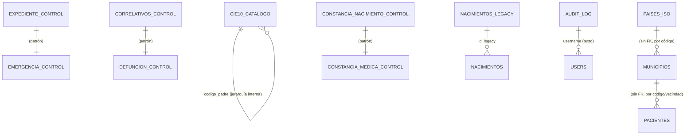

# Esquema de Base de Datos — `hospital` (PostgreSQL)

Base de datos de un hospital de la red pública de Guatemala (HOSP TECPÁN). Modelo relacional normalizado (3FN en el núcleo clínico) con tablas de catálogo, de control de correlativos y de datos históricos/legacy.

**Resumen:** 37 tablas · 47 foreign keys · extensiones `pg_trgm` + `unaccent`

---

## 1. Mapa general (agrupación por dominio)

| Grupo | Tablas | Función |
|-------|--------|---------|
| **Pacientes** | `pacientes`, `uisau` | Registro maestro + datos UISAU |
| **Atención clínica** | `consultas`, `ciclos_consulta`, `eventos_consulta`, `consultas_historial` | Ciclo de atención |
| **Especialistas** | `medicos`, `personal_salud`, `especialidades` | Recurso humano |
| **Registro civil / nacimientos** | `nacimientos`, `constancia_nacimiento`, `constancia_nacimiento_historial`, `nacimientos_legacy`, `nacimientos_historico`, `defunciones` | Nacimientos y defunciones |
| **Apoyo diagnóstico** | `laboratorios`, `rayos_x`, `procedimientos`, `proce_medicos` | Exámenes y procedimientos |
| **Censo / camas** | `encamamiento`, `censo_camas` | Ocupación hospitalaria |
| **SIGSA-3** | `sigsa3`, `sigsa3_registros`, `tipos_consulta`, `cie10_catalogo` | Consultas normalizadas SIGSA |
| **Administrativo** | `citas`, `prestamos`, `users`, `municipios`, `paises_iso`, `audit_log` | Citas, préstamos, usuarios, catálogos |
| **Control de correlativos** | `expediente_control`, `emergencia_control`, `correlativos_control`, `defuncion_control`, `constancia_nacimiento_control`, `constancia_medica_control` | Contadores por año |

---

## 2. Diagrama de relaciones (Mermaid ER)

```mermaid
erDiagram
    PACIENTES ||--o{ CONSULTAS : "paciente_id"
    PACIENTES ||--o{ NACIMIENTOS : "paciente_id (neonato)"
    PACIENTES ||--o{ NACIMIENTOS : "madre_id"
    PACIENTES ||--o{ CONSTANCIA_NACIMIENTO : "paciente_id / madre_id"
    PACIENTES ||--o{ DEFUNCIONES : "paciente_id / madre_id"
    PACIENTES ||--o{ CITAS : "paciente_id"
    PACIENTES ||--o{ SIGSA3 : "paciente_id"
    PACIENTES ||--o{ SIGSA3_REGISTROS : "paciente_id"
    PACIENTES ||--o{ PRESTAMOS : "id_paciente"
    PACIENTES ||--o{ UISAU : "id_paciente"

    CONSULTAS ||--o{ CICLOS_CONSULTA : "consulta_id"
    CONSULTAS ||--o{ EVENTOS_CONSULTA : "consulta_id"
    CONSULTAS ||--o{ LABORATORIOS : "consulta_id"
    CONSULTAS ||--o{ RAYOS_X : "consulta_id"
    CONSULTAS ||--o{ SIGSA3 : "consulta_id"
    CONSULTAS ||--o{ SIGSA3_REGISTROS : "consulta_id"
    CONSULTAS ||--o{ PRESTAMOS : "id_consulta"
    CONSULTAS ||--o{ CONSULTAS_HISTORIAL : "consulta_id"

    ESPECIALIDADES ||--o{ MEDICOS : "especialidad_id"
    ESPECIALIDADES ||--o{ CONSULTAS : "especialidad_id"
    ESPECIALIDADES ||--o{ CICLOS_CONSULTA : "especialidad_id"
    ESPECIALIDADES ||--o{ CITAS : "especialidad_id"
    ESPECIALIDADES ||--o{ PROCE_MEDICOS : "especialidad_id"
    ESPECIALIDADES ||--o{ PERSONAL_SALUD : "especialidad_id"
    ESPECIALIDADES ||--o{ SIGSA3 : "especialidad_id"
    ESPECIALIDADES ||--o{ SIGSA3_REGISTROS : "especialidad_id"

    MEDICOS ||--o{ PERSONAL_SALUD : "medico_id"
    MEDICOS ||--o{ CONSTANCIA_NACIMIENTO : "medico_id"
    MEDICOS ||--o{ DEFUNCIONES : "medico_id"
    MEDICOS ||--o{ SIGSA3 : "medico_id"
    MEDICOS ||--o{ SIGSA3_REGISTROS : "medico_id"

    TIPOS_CONSULTA ||--o{ SIGSA3 : "tipo_consulta_id"
    TIPOS_CONSULTA ||--o{ SIGSA3_REGISTROS : "tipo_consulta_id"
    CIE10_CATALOGO ||--o{ SIGSA3 : "codigo_cie_10_id"
    CIE10_CATALOGO ||--o{ SIGSA3_REGISTROS : "codigo_cie_10_id"

    CICLOS_CONSULTA ||--o{ LABORATORIOS : "ciclo_consulta_id"
    CICLOS_CONSULTA ||--o{ RAYOS_X : "ciclo_consulta_id"

    PROCEDIMIENTOS ||--o{ PROCE_MEDICOS : "id_procedimiento"
    ENCAMAMIENTO ||--o{ CENSO_CAMAS : "servicio_id"

    USERS ||--o{ CONSTANCIA_NACIMIENTO : "registrador_id"
    USERS ||--o{ DEFUNCIONES : "registrador_id"
    USERS ||--o{ NACIMIENTOS : "registrador_id"
    USERS ||--o{ CONSTANCIA_NACIMIENTO_HISTORIAL : "usuario_id"
    USERS ||--o{ CONSULTAS_HISTORIAL : "usuario_id"

    CONSTANCIA_NACIMIENTO ||--o{ CONSTANCIA_NACIMIENTO_HISTORIAL : "constancia_id"
    PERSONAL_SALUD ||--o{ SIGSA3 : "personal_salud_id"
    PERSONAL_SALUD ||--o{ SIGSA3_REGISTROS : "personal_salud_id"
```



**Tablas sin FK (independientes / catálogo / control):**



---

## 3. Núcleo normalizado (3FN)

La mayoría de las tablas siguen la **3ra forma normal**: datos primitivos en columnas simples, claves foráneas para identificación, y sin redundancia entre tablas.

### `pacientes` — registro maestro (31 cols)

| Columna | Tipo | Nota |
|---------|------|------|
| `id` | PK | |
| `expediente` | unique | Correlativo EXP-YYYY-###### |
| `cui` / `pasaporte` | unique nullable | Identificación nacional |
| `nombre` | JSONB | `{primer_nombre, segundo_nombre, primer_apellido, segundo_apellido}` |
| `nombre_completo` | derivada | Trigger `trg_set_nombre_completo` |
| `sexo`, `fecha_nacimiento`, `estado` | | `V`=vivo, `F`=fallecido, `I`=inactivo |
| `datos_extra` | JSONB | Socioeconómicos: `personal_hospital`, `estudiante_publico`, etc. |
| `metadatos` | JSONB | |
| `idioma_id`, `pueblo_id`, `nacionalidad`, `lugar_nacimiento` | | Referencias por valor |
| `discapacidad`, `educacion`, `estado_civil`, `ocupacion`, `es_estudiante_publico`, `es_personal_hospital` | | Desnormalizadas para reportes |

**Índices:** GIN sobre JSONB, trigram GIN sobre `nombre_completo`, parciales únicos (CUI/expediente no nulos).

### `sigsa3_registros` — consultas normalizadas (12 cols)

Tabla más limpia del módulo SIGSA: solo claves foráneas + hechos, sin datos redundantes.

| Columna | Tipo | Referencia |
|---------|------|------------|
| `id` | PK | |
| `paciente_id` | FK | `pacientes.id` |
| `medico_id` | FK nullable | `medicos.id` |
| `personal_salud_id` | FK nullable | `personal_salud.id` |
| `consulta_id` | FK nullable | `consultas.id` |
| `tipo_consulta_id` | FK | `tipos_consulta.id` |
| `codigo_cie_10_id` | FK nullable | `cie10_catalogo.id` |
| `especialidad_id` | FK nullable | `especialidades.id` |
| `fecha_consulta` | date | |
| `control` | int | Nº de consulta |
| `semana_gestacional` | int | |
| `normalized_at` | timestamp | |

### `nacimientos` — sin datos redundantes (11 cols)

Almacena solo la relación y hechos; el resto (expediente, sexo, fecha nacimiento, neonatales) se obtiene por **JOIN con `pacientes`**. Columnas computadas: `peso_gramos`, `clasificacion_nacimiento` (EBP/MBP/BP/PN), `trabajo_parto` (Prematuro/Término/Prolongado).

| Columna | Referencia |
|---------|------------|
| `paciente_id` | FK → `pacientes.id` (el neonato) |
| `madre_id` | FK → `pacientes.id` (la madre) |
| `registrador_id` | FK → `users.id` |
| `id_legacy` | → `nacimientos_legacy.id` |

---

## 4. Joins principales (los que usa la API)

### 4.1 Consulta enriquecida — `sigsa3_registros` (módulo `sigsa3_registros`)

```sql
SELECT r.*,
       p.nombre_completo       AS paciente_nombre,
       p.expediente            AS expediente,
       p.sexo                  AS sexo,
       m.nombre                AS medico_nombre,
       m.colegiado             AS colegiado,
       ps.nombre               AS personal_salud_nombre,
       tc.nombre               AS tipo_consulta_nombre,
       c.descripcion           AS cie10_descripcion,
       e.nombre                AS especialidad_nombre
FROM sigsa3_registros r
LEFT JOIN pacientes        p  ON p.id  = r.paciente_id
LEFT JOIN medicos          m  ON m.id  = r.medico_id
LEFT JOIN personal_salud   ps ON ps.id = r.personal_salud_id
LEFT JOIN tipos_consulta   tc ON tc.id = r.tipo_consulta_id
LEFT JOIN cie10_catalogo   c  ON c.id  = r.codigo_cie_10_id
LEFT JOIN especialidades   e  ON e.id  = r.especialidad_id;
```

### 4.2 Consulta enriquecida — `sigsa3` (módulo `sigsa3`, staging)

Igual que la anterior pero la tabla staging mantiene también columnas textuales originales (`personal_salud`, `codigo_cie_10`, `tipo_consulta`, `dx`, `nombre_paciente`) para trazabilidad del dato importado.

### 4.3 `nacimientos` → `pacientes` (módulo `nacimientos`)

```sql
SELECT n.id, n.madre_id, n.peso_gramos, n.clasificacion_nacimiento, n.trabajo_parto,
       p.nombre_completo, p.expediente, p.sexo, p.fecha_nacimiento,
       p.datos_extra->'neonatales' AS neonatales
FROM nacimientos n
JOIN pacientes p ON p.id = n.paciente_id;
```

### 4.4 `consultas` enriquecida (módulo `consultas`)

```sql
SELECT c.*, p.nombre_completo AS paciente_nombre, p.expediente,
       e.nombre AS especialidad_nombre
FROM consultas c
LEFT JOIN pacientes p ON p.id = c.paciente_id
LEFT JOIN especialidades e ON e.id = c.especialidad_id;
```

### 4.5 `proce_medicos` → catálogo (módulo `procedimientos`)

```sql
SELECT pm.*, pr.nombre AS procedimiento_nombre, pr.abreviatura,
       e.nombre AS especialidad_nombre
FROM proce_medicos pm
LEFT JOIN procedimientos pr ON pr.id = pm.id_procedimiento
LEFT JOIN especialidades e   ON e.id  = pm.especialidad_id;
```

### 4.6 `constancia_nacimiento` enriquecida

```sql
SELECT cn.*, p.nombre_completo AS paciente_nombre, p.expediente,
       m.nombre AS medico_nombre, u.nombre AS registrador_nombre,
       madre.nombre_completo AS madre_nombre
FROM constancia_nacimiento cn
LEFT JOIN pacientes p ON p.id = cn.paciente_id
LEFT JOIN medicos m   ON m.id = cn.medico_id
LEFT JOIN users u     ON u.id = cn.registrador_id
LEFT JOIN pacientes madre ON madre.id = cn.madre_id;
```

### 4.7 `censo_camas` → `encamamiento`

```sql
SELECT cc.*, en.nombre_servicio, en.camas_censables
FROM censo_camas cc
LEFT JOIN encamamiento en ON en.id = cc.servicio_id;
```

### 4.8 `defunciones` enriquecida

```sql
SELECT d.*, p.nombre_completo, p.expediente, m.nombre AS medico_nombre,
       u.nombre AS registrador_nombre
FROM defunciones d
LEFT JOIN pacientes p ON p.id = d.paciente_id
LEFT JOIN medicos m   ON m.id = d.medico_id
LEFT JOIN users u     ON u.id = d.registrador_id;
```

### 4.9 Estadísticas SIGSA-3 (módulo `estadisticas`)

```sql
-- Por especialidad, tipo y sexo
SELECT e.nombre AS especialidad, tc.nombre AS tipo_consulta, p.sexo, COUNT(*) AS total
FROM sigsa3 s
JOIN especialidades e ON e.id = s.especialidad_id
JOIN tipos_consulta tc ON tc.id = s.tipo_consulta_id
LEFT JOIN pacientes p ON p.id = s.paciente_id
WHERE s.fecha_consulta BETWEEN :desde AND :hasta
GROUP BY e.nombre, tc.nombre, p.sexo;

-- Diagnósticos frecuentes (top por grupo)
SELECT c.codigo, c.descripcion, e.nombre AS especialidad, tc.nombre AS tipo_consulta,
       p.sexo, COUNT(*) AS total
FROM sigsa3 s
JOIN cie10_catalogo c ON c.id = s.codigo_cie_10_id
LEFT JOIN especialidades e ON e.id = s.especialidad_id
LEFT JOIN tipos_consulta tc ON tc.id = s.tipo_consulta_id
LEFT JOIN pacientes p ON p.id = s.paciente_id
WHERE s.fecha_consulta BETWEEN :desde AND :hasta
  AND NOT (c.codigo LIKE 'Z:%' OR c.codigo IN ('O82.9','O80.9','O62.0'))
GROUP BY c.codigo, c.descripcion, e.nombre, tc.nombre, p.sexo
ORDER BY total DESC;
```

### 4.10 KPIs del dashboard (módulo `totales`)

```sql
SELECT COUNT(*) FROM pacientes;                                  -- totales
SELECT COUNT(*) FROM pacientes WHERE estado = 'V';               -- activos
SELECT COUNT(*) FROM consultas;                                  -- consultas totales
SELECT COUNT(*) FROM consultas WHERE fecha_consulta = :hoy;      -- consultas hoy
SELECT COUNT(*) FROM consultas WHERE tipo_consulta = 1 AND fecha_consulta = :hoy;  -- COEX
SELECT COUNT(*) FROM consultas WHERE tipo_consulta = 2 AND fecha_consulta = :hoy;  -- hosp
SELECT COUNT(*) FROM consultas WHERE tipo_consulta = 3 AND fecha_consulta = :hoy;  -- emerg
```

---

## 5. Tablas de control de correlativos

Patrón idéntico: contador por año para generar números correlativos sin duplicados.

```sql
-- Ejemplo: expediente_control
CREATE TABLE expediente_control (
    anio               INT PRIMARY KEY,
    ultimo_correlativo INT NOT NULL DEFAULT 0,
    actualizado_en     TIMESTAMP
);
```

| Tabla | Correlativo generado |
|-------|---------------------|
| `expediente_control` | EXP-YYYY-###### |
| `emergencia_control` | EMERG-###### |
| `constancia_nacimiento_control` | CN-###### |
| `constancia_medica_control` | CM-###### |
| `defuncion_control` | DF-###### |
| `correlativos_control` | Genérico (`tipo` por columna) |

**Uso en transacción** (bloqueo de fila para concurrencia):

```sql
INSERT INTO expediente_control (anio, ultimo_correlativo)
VALUES (:anio, 1)
ON CONFLICT (anio) DO UPDATE
SET ultimo_correlativo = expediente_control.ultimo_correlativo + 1
RETURNING ultimo_correlativo;
```

---

## 6. Catálogos (lookup tables)

| Tabla | PK | Columnas | Usada por |
|-------|----|----------|-----------|
| `especialidades` | `id` | `nombre`, `abreviatura`, `codigo` | medicos, consultas, ciclos, citas, proce_medicos, personal_salud, sigsa3, sigsa3_registros |
| `tipos_consulta` | `id` | `nombre`, `descripcion` | sigsa3, sigsa3_registros |
| `cie10_catalogo` | `id` | `codigo`, `descripcion`, `nivel`, `codigo_padre`, `fuente` | sigsa3, sigsa3_registros (auto-jerárquico) |
| `procedimientos` | `id` | `abreviatura`, `nombre`, `descripcion`, `anestesia` | proce_medicos |
| `encamamiento` | `id` | `nombre_servicio`, `descripcion`, `camas_censables`, `activo` | censo_camas |
| `personal_salud` | `id` | `nombre`, `medico_id`→medicos, `especialidad_id` | sigsa3, sigsa3_registros |
| `municipios` | `codigo` | `vecindad`, `municipio`, `departamento` | pacientes (por valor) |
| `paises_iso` | `id` | `nombre`, `codigo_iso3` | pacientes (nacionalidad) |

---

## 7. Tablas históricas / auditoría / legacy

| Tabla | Propósito |
|-------|-----------|
| `audit_log` | Registro de accesos: `tabla`, `registro_id`, `endpoint`, `metodo`, `username` |
| `consultas_historial` | Trazabilidad de cambios en consultas (`consulta_id`→consultas, `usuario_id`→users) |
| `constancia_nacimiento_historial` | Historial de cambios de constancias (`constancia_id`→constancia_nacimiento) |
| `nacimientos_legacy` | Datos históricos importados (35 cols, desnormalizados, formato papel) |
| `nacimientos_historico` | Copia histórica de nacimientos (14 cols) |
| `uisau` | Registro UISAU extendido del paciente (duplica `consulta_id`/`id_consulta`) |

---

## 8. Convenciones

- **Nombres:** tablas en plural snake_case (`pacientes`, `medicos`); `proce_medicos` (excepción, por `procedimientos`).
- **PK:** `id` secuencial, salvo `municipios` (PK `codigo`) y tablas de control (PK `anio` o `tipo+anio`).
- **FK:** `*_id` apuntando a la PK de la tabla padre.
- **Timestamps:** `created_at`/`updated_at` o `creado_en`/`actualizado_en` según módulo.
- **Soft delete:** columnas `activo`/`estado` en lugar de borrado físico (consultas, citas, prestamos, procedimientos, encamamiento).
- **JSONB:** `pacientes.datos_extra`/`metadatos`, `consultas.indicadores`, `citas.datos_extra`, `ciclos_consulta.datos_medicos`, `eventos_consulta.datos`.
- **Trigger:** `trg_set_nombre_completo` regenera `pacientes.nombre_completo` desde `nombre` JSONB.
